# Capítulo IV:  Solution Software Design.

## 4.1. Strategic-Level Domain-Driven Design.
En esta sección, explicaremos el proceso de toma de decisiones estratégicas de diseño de software aplicando
Domain-Driven Design (DDD). Nos enfocamos en identificar subdominios críticos y contextos delimitados, alineando 
el diseño con los objetivos del negocio. Mediante técnicas colaborativas como EventStorming, modelamos flujos de 
mensajes y definimos contextos adecuados y sus interrelaciones. Luego, Context Mapping ayudó a establecer relaciones
y patrones de integración, formando una base sólida para la arquitectura. Se detallan aquí los pasos clave, desde 
el descubrimiento inicial hasta la arquitectura final, fundamentados en los principios de DDD.
### 4.1.1. EventStorming.
Se llevó a cabo un proceso de Event Storming para identificar los Bounded Contexts de nuestro sistema. Durante este
proceso, se siguieron los pasos que se describen a continuación:

Collect Domain Events 

Se plantean eventos importantes de todos los grupos funcionales en tiempo pasado y nomenclatura en inglés.

Timeline

Se ordenan todos los eventos y se empieza con un “happy path” es decir, eventos exitosos.
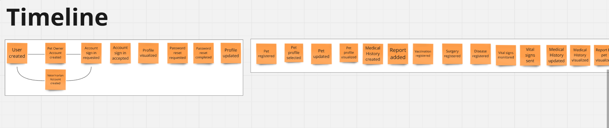
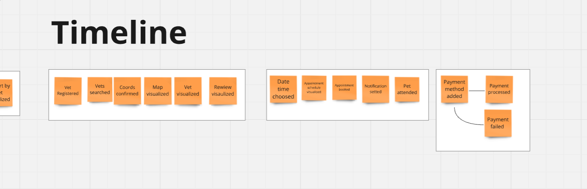

Pain and Pivotal Points

En este paso se resaltan con un diamante los eventos por aclarar o que requieren de más conocimientos de especialistas.
Por otro lado, los pivotal points son puntos de cambios que se marcan con una barra vertical.
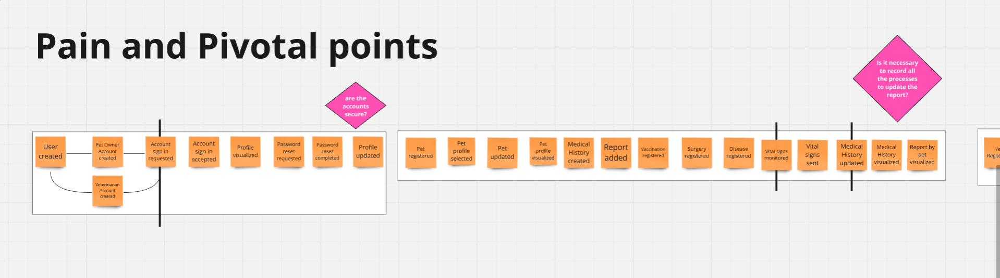
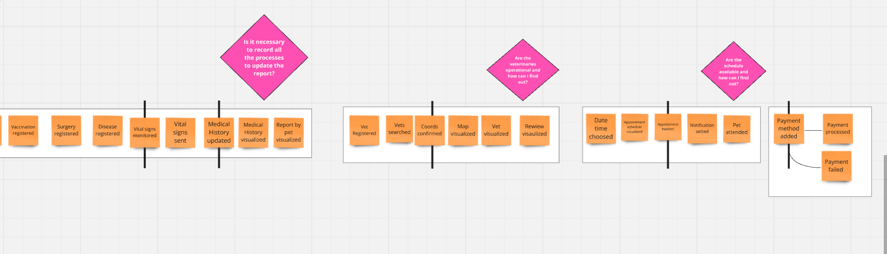

#### 4.1.1.1 Candidate Context Discovery

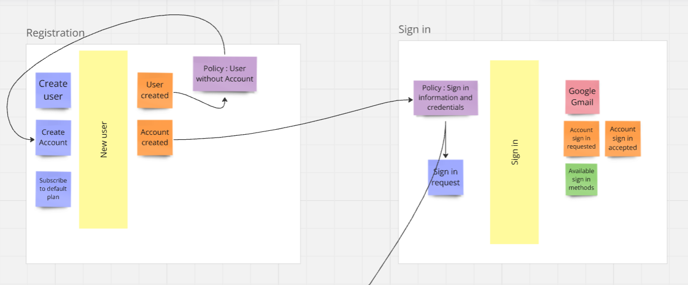
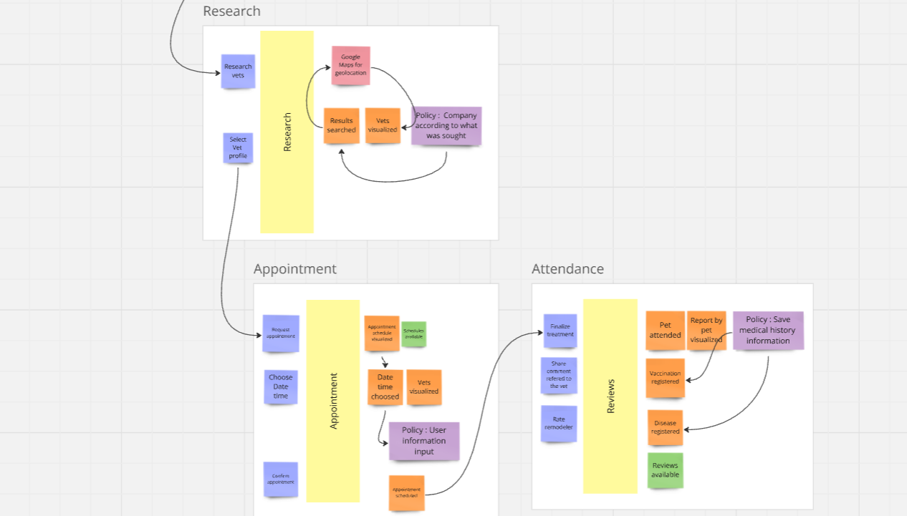

#### 4.1.1.2 Domain Message Flows Modeling.

Dado el diagrama de eventos de EventStorming que ya se ha presentado, el siguiente paso es modelar los flujos de
mensajes. Para esto, podemos identificar las interacciones clave que ocurren en el sistema, y cómo estos mensajes 
desencadenan acciones o actualizaciones en otros contextos.

Solicitud de inicio de sesión: En este escenario, un actor (Customer) crea una cuenta en nuestro sistema y, de inmediato, 
se suscribe al plan predeterminado para validar sus credenciales, gracias a una política establecida. Este evento se
registra en nuestro backend, lo que confirma la suscripción. Una vez verificada la suscripción dentro del bounded
context de *Access*, al cliente se le permitirá acceder al comando de solicitud de inicio de sesión (Sign in request).
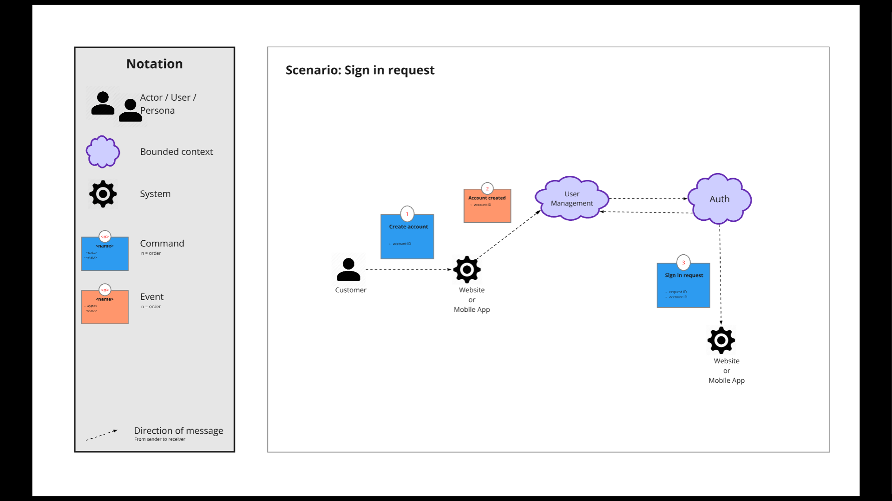

**Búsqueda de una veterinaria:** En este escenario, un actor (Customer) interactúa con el frontend solicitando el 
ingreso a su cuenta mediante el comando (*Sign in request*). Tras realizar las validaciones de credenciales en *Account 
Access* y verificar la cuenta, se le permitirá al cliente buscar veterinarias usando el comando (*Search Vet*). Una vez 
que acceda a esta función a través del frontend, el evento de (*Results searched*) será activado en nuestro backend 
dentro del bounded context de *Research and appointment*. Finalmente, podrá seleccionar el perfil de una veterinaria
mediante (*Select Vet profile*).
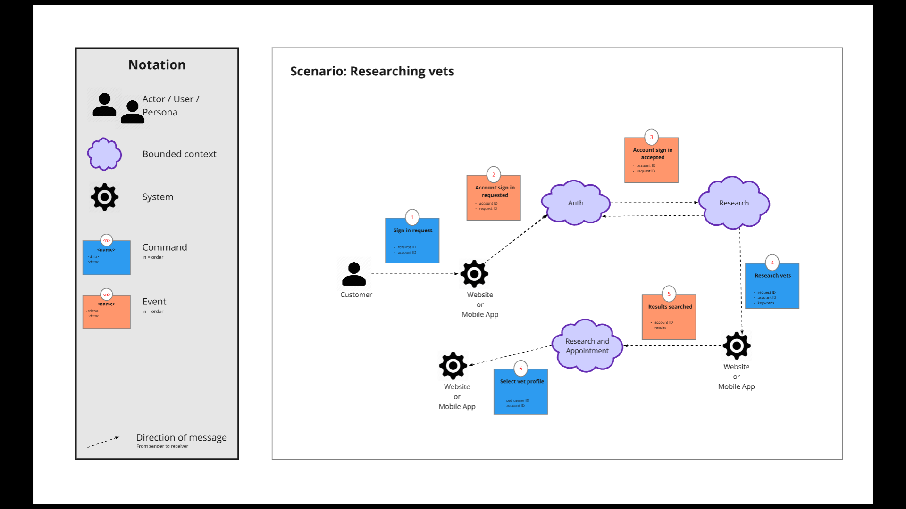

**Agendar una cita con un veterinario:** En este escenario, tras verificar las credenciales del cliente al iniciar
sesión, se le permite elegir un perfil de veterinario. Una vez completada esta acción, nuestro backend activa el evento
(*Vet profile selected*) y el cliente puede solicitar una cita utilizando el comando (*Request appointment*).
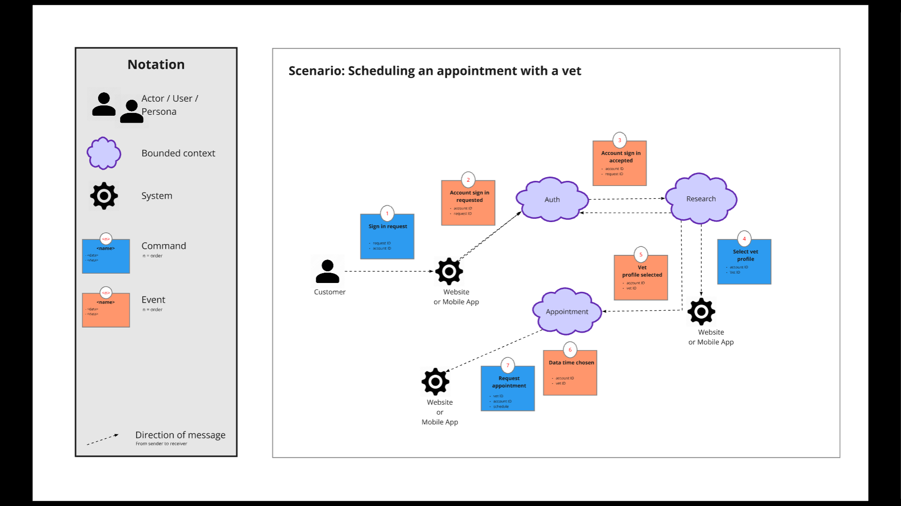

**Manejar el historial médico de la mascota:** Para gestionar el historial médico, el actor (Customer) solicita una cita
con un veterinario. Luego, se le pedirá información relevante sobre diagnósticos de enfermedades y actualizaciones de
reportes. Este comando se ejecuta desde nuestro frontend mediante (*Collect medical information*). Si la información se 
completa, se envía a la plataforma a través de (*Send medical information to platform*). Finalmente, una vez que toda la
información esté en nuestro backend, el veterinario puede actualizar el historial médico de la mascota usando el 
comando (*Update medical history*).
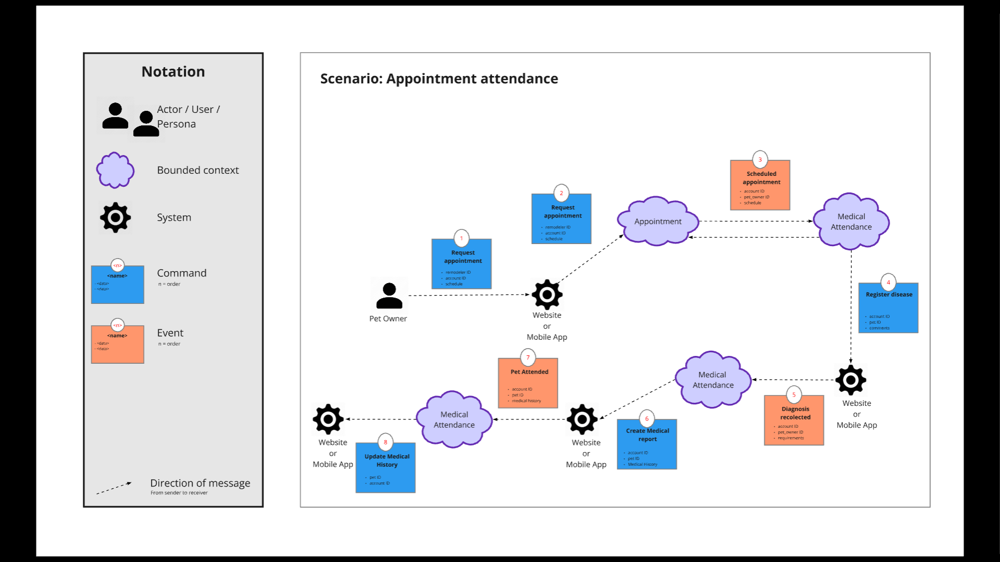

#### 4.1.1.3 Bounded Context Canvases.

Se crearon lienzos de Bounded Context para cada uno de los contextos identificados en el proceso de EventStorming.
Estos lienzos ayudan a definir los límites de cada contexto, sus responsabilidades y las interacciones
con otros contextos.

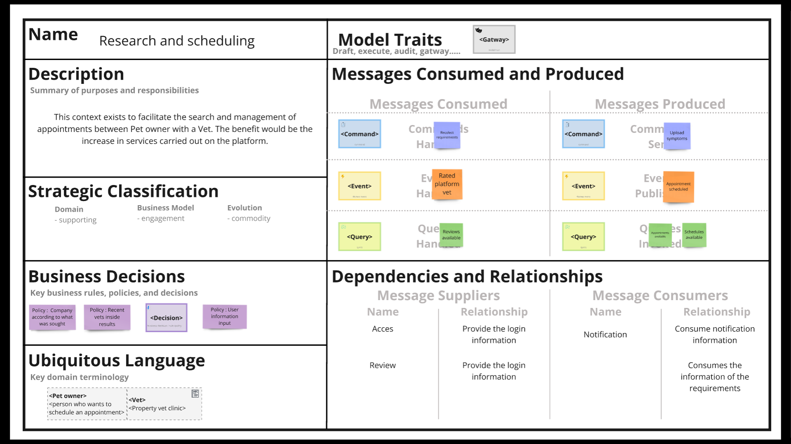
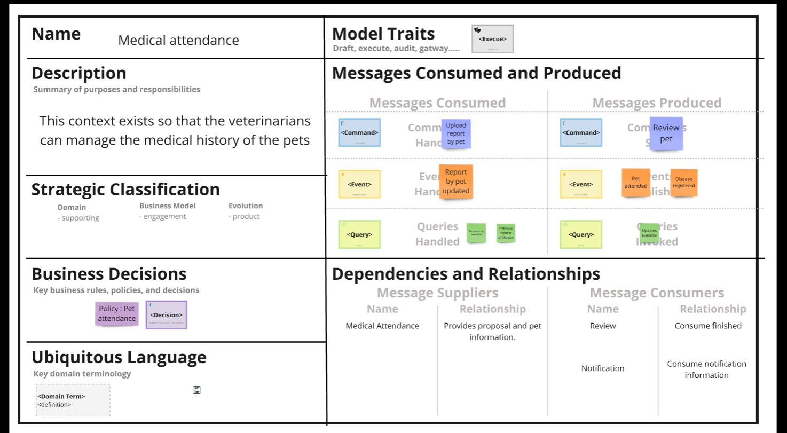
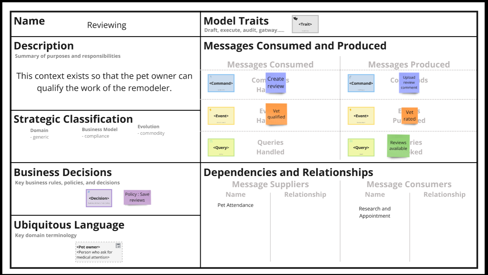
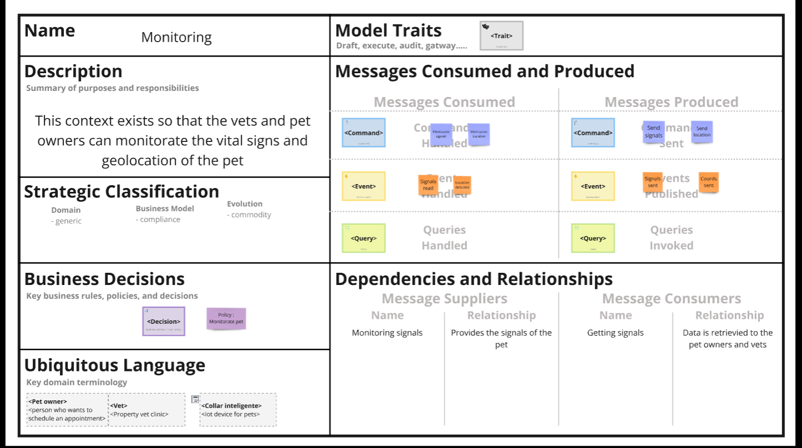

### 4.1.2. Context Mapping.

### 4.1.3. Software Architecture.
En esta sección, se describe la Arquitectura de Software de la solución utilizando el **C4 Model** para su representación
visual, a través de la herramienta Structurizr. Se introducirá la estructura general del sistema, comenzando por una
vista de alto nivel (Context Level Diagram) y detallando las interacciones y componentes clave (Container Level Diagrams),
proporcionando así una visión clara y comprensible de la arquitectura propuesta.

#### 4.1.3.2. Software Architecture Context Level Diagrams.

A continuación mostramos el diagrama de contexto de la arquitectura de software de la solución propuesta. En este diagrama
se presentan los actores externos que interactúan con el sistema y los sistemas externos con los que se comunica.
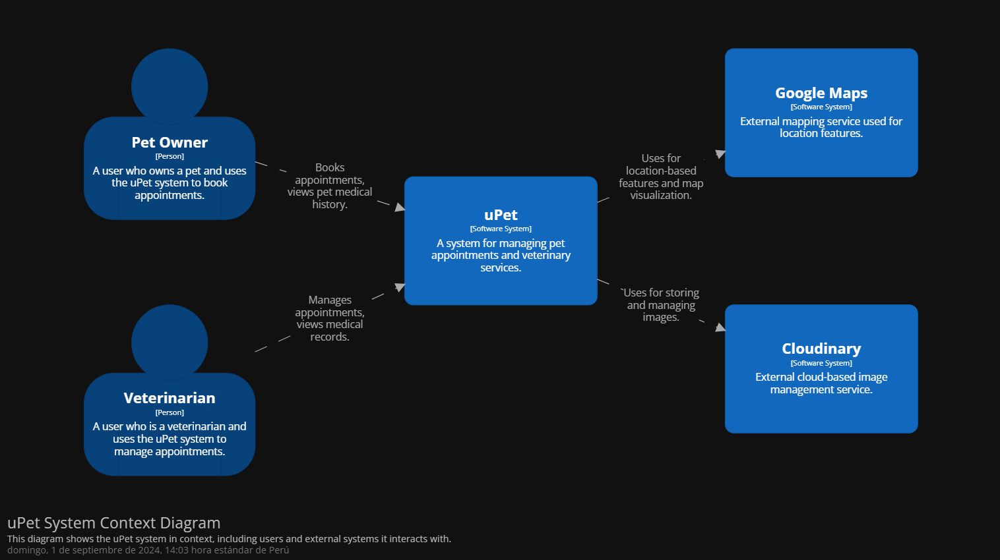

#### 4.1.3.3. Software Architecture Container Level Diagrams.

En esta sección se presenta el diagrama de contenedores de la solución propuesta. Este diagrama detalla los contenedores
de software y sus interrelaciones, proporcionando una visión general de la estructura interna del sistema.

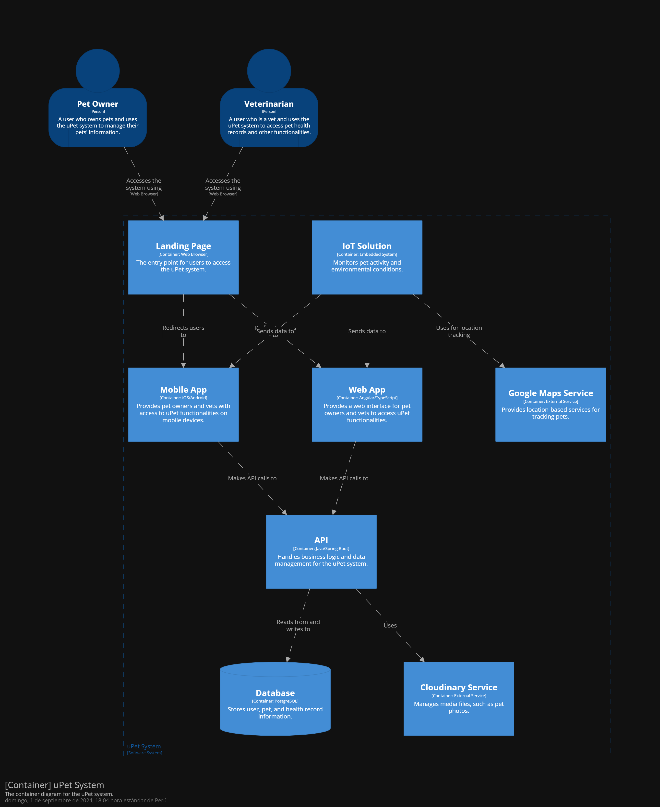

#### 4.1.3.4. Software Architecture Deployment Diagrams.
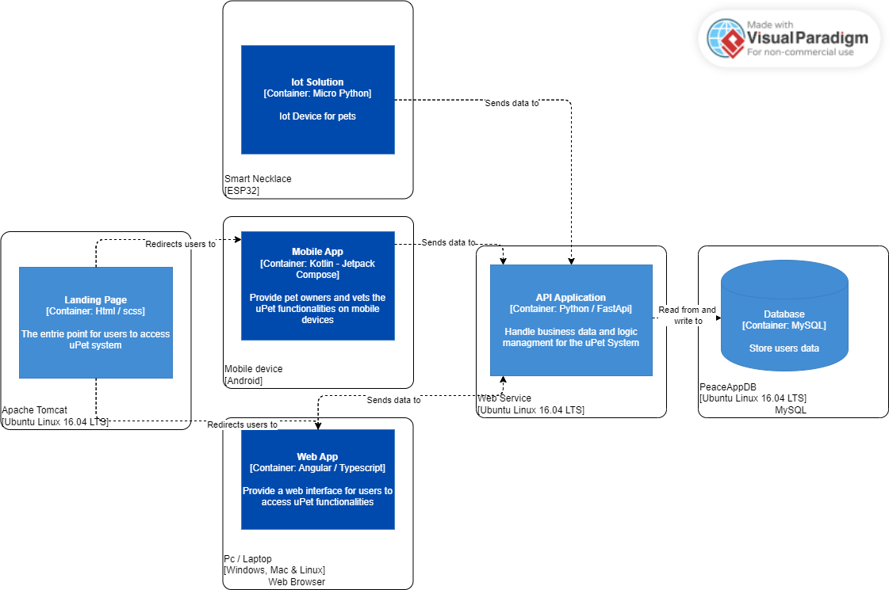

## 4.2. Tactical-Level Domain-Driven Design

### 4.2.1. Bounded Context: Identity and Access Context
- [Domain Layer](#4211-domain-layer)
- [Interface Layer](#4212-interface-layer)
- [Application Layer](#4213-application-layer)
- [Infrastructure Layer](#4214-infrastructure-layer)
- [Bounded Context Software Architecture Component Level Diagrams](#4215-bounded-context-software-architecture-component-level-diagrams)
- [Bounded Context Software Architecture Code Level Diagrams](#4216-bounded-context-software-architecture-code-level-diagrams)

#### 4.2.1.1. Domain Layer
#### Models
| **Clase**       | **Descripción**                                                                                             |
|-----------------|-------------------------------------------------------------------------------------------------------------|
| **User**        | Representa la entidad de usuario con atributos como `id`, `name`, `email`, `password`, `userType`, etc. Relacionado con `PetOwner` y `Veterinarian`. |
| **PetOwner**    | Representa la entidad de propietario de mascotas con atributos como `id`, `userId`, `numberPhone`, `location`, `subscriptionType`, etc. Relacionado con `User`, `Pet`, y `Review`. |
| **Veterinarian** | Representa la entidad de veterinario con atributos como `id`, `user_id`, `description`, `experience`, `clinic_id`, etc. Relacionado con `User`, `VeterinaryClinic`, `Availability`, `Appointment`, y `Review`. |

#### Enums
| **Enum**                | **Descripción**                                          |
|-------------------------|----------------------------------------------------------|
| **UserType**            | Enum para los tipos de usuarios: `Vet`, `Owner`.        |
| **SubscriptionType**    | Enum para los tipos de suscripciones: `Basic`, `Advanced`, `Pro`. |

#### Validators
| **Clase**              | **Descripción**                                                                                                           |
|------------------------|---------------------------------------------------------------------------------------------------------------------------|
| **SchemaValidator**   | Contiene métodos para validar esquemas, asegurando que los campos requeridos estén presentes en los datos de entrada. |

#### 4.2.1.2. Interface Layer
Description of the design and components of the interface layer for the Identity and Access Context.

#### Schemas
| **Esquema**                | **Descripción**                                                                                      |
|----------------------------|------------------------------------------------------------------------------------------------------|
| **UserSchemaGet**          | Esquema para la respuesta de la obtención de un usuario. Incluye `id`, `name`, `email`, `userType`, `image_url`, `registered`. |
| **UserSchemaPost**         | Esquema para la creación de un nuevo usuario. Incluye `name`, `email`, `password`, `userType`.      |
| **UserChangeImage**        | Esquema para actualizar la imagen de un usuario. Incluye `image_url`, `role`.                       |
| **VeterinarianSchemaPost** | Esquema para la creación de un nuevo veterinario. Incluye `clinicName`, `otp_password`.             |
| **VeterinarianUpdateInformation** | Esquema para la actualización de la información de un veterinario. Incluye `name`, `description`, `experience`. |
| **VeterinarianSchemaGet**  | Esquema para la respuesta de la obtención de un veterinario. Incluye `id`, `name`, `clinicId`, `image_url`, `description`, `experience`, `user_id`. |
| **VeterinarianProfileSchemaGet** | Esquema para la respuesta detallada del perfil de un veterinario. Incluye `id`, `name`, `image_url`, `description`, `experience`, `clinicName`, `workingHourStart`, `workingHourEnd`, `clinicAddress`, `reviews`. |

#### 4.2.1.3. Application Layer
Description of the design and components of the application layer for the Identity and Access Context.

#### Services

| **Servicio**        | **Método**                           | **Descripción**                                                                                                      |
|---------------------|--------------------------------------|----------------------------------------------------------------------------------------------------------------------|
| **UserService**     | `get_user_by_id(user_id: int, db: Session)` | Recupera un usuario por su ID. Lanza una excepción 404 si el usuario no existe.                                      |
|                     | `change_image(role_id: int, role, image: str, db: Session)` | Cambia la imagen de perfil del usuario según su rol (Owner o Veterinarian). Actualiza la entidad `User` y guarda los cambios. |
| **PetOwnerService** | `create_new_petowner(user_id: int, petowner: PetOwnerSchemaPost, db: Session = Depends(get_db))` | Crea un nuevo registro de propietario de mascotas. Verifica el tipo de usuario, si ya está registrado y el formato del teléfono. Emite un token de acceso. |
|                     | `get_petowners(db: Session = Depends(get_db))` | Recupera todos los propietarios de mascotas, incluyendo sus datos de usuario asociados.                           |
|                     | `get_petowner_by_user_id(user_id: int, db: Session)` | Recupera un propietario de mascotas por su ID de usuario.                                                            |
|                     | `get_petOwner_by_id(petOwner_id: int, db: Session) -> PetOwnerSchemaGet` | Recupera un propietario de mascotas por su ID.                                                                      |
|                     | `change_Datapetowner(petowner_id: int, petowner: PetOwnerUpdateInformation, db: Session)` | Actualiza los datos de un propietario de mascotas existente.                                                         |
| **VeterinarianService** | `create_new_veterinarian(user_id: int, veterinarian: VeterinarianSchemaPost, db: Session)` | Crea un nuevo registro de veterinario. Verifica el tipo de usuario, si ya está registrado, y valida el OTP y la clínica. Emite un token de acceso. |
|                     | `get_all_vets(db: Session = Depends(get_db)) -> List[VeterinarianSchemaGet]` | Recupera todos los veterinarios, incluyendo sus datos de usuario asociados.                                        |
|                     | `get_vet_by_user_id(user_id: int, db: Session) -> VeterinarianSchemaGet` | Recupera un veterinario por su ID de usuario.                                                                        |
|                     | `get_vet_by_id(vet_id: int, db: Session) -> VeterinarianSchemaGet` | Recupera un veterinario por su ID.                                                                                   |
|                     | `get_vet_by_id_details(vet_id: int, db: Session) -> VeterinarianProfileSchemaGet` | Recupera información detallada sobre un veterinario, incluyendo reseñas.                                            |
|                     | `get_vets_by_clinic_id(clinic_id: int, db: Session) -> List[VeterinarianSchemaGet]` | Recupera veterinarios por ID de clínica.                                                                            |
|                     | `get_available_times(vet_id: int, day: date, db: Session)` | Recupera los horarios disponibles para un veterinario en un día específico.                                        |
|                     | `change_DataVet(vet_id: int, vet: VeterinarianUpdateInformation, db: Session)` | Actualiza los datos de un veterinario existente.                                                                    |

#### 4.2.1.4. Infrastructure Layer
Description of the design and components of the infrastructure layer for the Identity and Access Context.\

#### **Repositorios**

| Clase/Servicio             | Descripción                                                                                           |
|----------------------------|-------------------------------------------------------------------------------------------------------|
| **UserRepository**         | Maneja la interacción con la base de datos para la entidad `User`. Incluye operaciones como crear, leer, actualizar y eliminar usuarios. |
| **PetOwnerRepository**     | Maneja la interacción con la base de datos para la entidad `PetOwner`. Permite crear, leer, actualizar y eliminar propietarios de mascotas. |
| **VeterinarianRepository** | Maneja la interacción con la base de datos para la entidad `Veterinarian`. Incluye operaciones de gestión de veterinarios como crear, leer, actualizar y eliminar. |

#### **Mappers**

| Clase/Servicio             | Descripción                                                                                           |
|----------------------------|-------------------------------------------------------------------------------------------------------|
| **UserMapper**             | Mapea la entidad `User` a la base de datos usando SQLAlchemy. Define cómo se traducen las propiedades del modelo `User` en columnas de la tabla de base de datos. |
| **PetOwnerMapper**         | Mapea la entidad `PetOwner` a la base de datos usando SQLAlchemy. Define cómo se traducen las propiedades del modelo `PetOwner` en columnas de la tabla de base de datos. |
| **VeterinarianMapper**     | Mapea la entidad `Veterinarian` a la base de datos usando SQLAlchemy. Define cómo se traducen las propiedades del modelo `Veterinarian` en columnas de la tabla de base de datos. |

#### Routes

| **Ruta**                                                             | **Método**   | **Descripción**                                                                                                           |
|----------------------------------------------------------------------|--------------|---------------------------------------------------------------------------------------------------------------------------|
| **PetOwners**                                                         |              |                                                                                                                           |
| `/petowners/{user_id}`                                                | POST         | Crear un nuevo propietario de mascotas.                                                                                  |
| `/petowners`                                                          | GET          | Obtener todos los propietarios de mascotas.                                                                             |
| `/petowners/users/{user_id}`                                          | GET          | Obtener un propietario de mascotas por ID de usuario.                                                                    |
| `/petowners/{petOwner_id}`                                            | GET          | Obtener un propietario de mascotas por ID de propietario.                                                                |
| `/petowners/{petOwner_id}`                                            | PUT          | Actualizar la información de un propietario de mascotas.                                                                 |
| **Users**                                                             |              |                                                                                                                           |
| `/users`                                                              | GET          | Obtener todos los usuarios.                                                                                             |
| `/users/{user_id}`                                                    | GET          | Obtener un usuario por ID.                                                                                              |
| `/users/{role_id}`                                                    | PUT          | Cambiar la imagen de un usuario.                                                                                        |
| **Veterinarians**                                                     |              |                                                                                                                           |
| `/veterinarians/{user_id}`                                            | POST         | Crear un nuevo veterinario.                                                                                             |
| `/veterinarians`                                                      | GET          | Obtener todos los veterinarios.                                                                                         |
| `/veterinarians/users/{user_id}`                                      | GET          | Obtener un veterinario por ID de usuario.                                                                               |
| `/veterinarians/{vet_id}`                                             | GET          | Obtener un veterinario por ID.                                                                                          |
| `/veterinarians/vets/{clinic_id}`                                    | GET          | Obtener veterinarios por ID de clínica.                                                                                  |
| `/veterinarians/reviews/{vet_id}`                                    | GET          | Obtener detalles del perfil de un veterinario, incluyendo reseñas.                                                        |
| `/veterinarians/{vet_id}/available_times`                            | POST         | Obtener los horarios disponibles de un veterinario.                                                                     |
| `/veterinarians/{vet_id}`                                             | PUT          | Actualizar la información de un veterinario.                                                                            |

#### 4.2.1.5. Bounded Context Software Architecture Component Level Diagrams
Component-level diagrams for the Identity and Access Context, showing the internal structure of components.

#### 4.2.1.6. Bounded Context Software Architecture Code Level Diagrams
Code-level diagrams for the Identity and Access Context, detailing the classes and code structure.

##### 4.2.1.6.1. Bounded Context Domain Layer Class Diagrams
Class diagrams for the domain layer of the Identity and Access Context.

##### 4.2.1.6.2. Bounded Context Database Design Diagram
Database design diagram for the Identity and Access Context.

### 4.2.2. Bounded Context: Veterinary Clinic Context
- [Domain Layer](#4221-domain-layer)
- [Interface Layer](#4222-interface-layer)
- [Application Layer](#4223-application-layer)
- [Infrastructure Layer](#4224-infrastructure-layer)
- [Bounded Context Software Architecture Component Level Diagrams](#4225-bounded-context-software-architecture-component-level-diagrams)
- [Bounded Context Software Architecture Code Level Diagrams](#4226-bounded-context-software-architecture-code-level-diagrams)

#### 4.2.2.1. Domain Layer
Description of the design and components of the domain layer for the Veterinary Clinic Context.
#### Models
| **Clase**           | **Descripción**                                                                                                           |
|---------------------|---------------------------------------------------------------------------------------------------------------------------|
| **OTP**             | Representa el código OTP (One Time Password) utilizado para verificar identidad. Atributos: `id`, `otp`, `expiration_time`, `clinicId`. |
| **VeterinaryClinic** | Representa la entidad de una clínica veterinaria con atributos como `id`, `name`, `location`, `services`, `office_hours_start`, `office_hours_end`, `phone_number`, `description`, `image_url`. Relacionado con `Veterinarian`. |
| **Availability**    | Representa la disponibilidad de un veterinario con atributos como `id`, `date`, `start_time`, `end_time`, `veterinarian_id`, `is_available`. Relacionado con `Veterinarian`. |
| **Appointment**     | Representa una cita médica con atributos como `id`, `date_day`, `description`, `pet_id`, `veterinarian_id`, `start_time`, `end_time`, `status`, `diagnosis`, `treatment`. Relacionado con `Pet` y `Veterinarian`. |

#### 4.2.2.2. Interface Layer
Description of the design and components of the interface layer for the Veterinary Clinic Context.

#### Schemas
| **Esquema**                           | **Descripción**                                                                                          |
|---------------------------------------|----------------------------------------------------------------------------------------------------------|
| **AppointmentSchemaCreate**           | Esquema para crear una nueva cita. Incluye `date_day`, `description`, `start_time`, `pet_id`, `veterinarian_id`. Método `to_model` para convertir a un modelo `Appointment`. |
| **AppointmentSchemaUpdate**           | Esquema para actualizar una cita existente. Incluye `diagnosis`, `treatment`.                                                                              |
| **AppointmentSchemaGet**              | Esquema para obtener una cita. Incluye `id`, `date_day`, `description`, `start_time`, `end_time`, `pet_id`, `veterinarian_id`, `status`, `diagnosis`, `treatment`. Método `from_orm` para convertir de un modelo `Appointment`. |
| **AvailabilitySchema**                | Esquema para disponibilidad de un veterinario. Incluye `date`, `start_time`, `end_time`, `veterinarian_id`, `is_available`. Método `from_orm` para convertir de un modelo `Availability`. |
| **VeterinaryClinicSchemaPost**        | Esquema para la creación de una nueva clínica veterinaria. Incluye `name`, `location`, `phone_number`, `description`, `office_hours_start`, `office_hours_end`. Método `to_model` para convertir a un modelo `VeterinaryClinic`. |
| **AvailabilitySchemaPost**            | Esquema para especificar la fecha de disponibilidad de un veterinario. Incluye `date`.                                                                  |
| **VeterinaryClinicSchemaGet**         | Esquema para obtener una clínica veterinaria. Incluye `id`, `name`, `location`, `services`, `image_url`, `description`, `phone_number`, `office_hours_start`, `office_hours_end`. |

#### 4.2.2.3. Application Layer
Description of the design and components of the application layer for the Veterinary Clinic Context.
#### Services
| **Servicio**             | **Método**                                                                                                     | **Descripción**                                                                                                              |
|--------------------------|----------------------------------------------------------------------------------------------------------------|------------------------------------------------------------------------------------------------------------------------------|
| **AppointmentService**   | `get_all_appointments(db: Session)`                                                                            | Recupera todas las citas y las devuelve como una lista de objetos `AppointmentSchemaGet`.                                  |
|                          | `get_appointments_by_pet_id(pet_id: int, db: Session)`                                                         | Recupera todas las citas asociadas a una mascota por su ID. Lanza una excepción 404 si la mascota no existe.                |
|                          | `get_appointments_by_owner_id(owner_id: int, db: Session)`                                                      | Recupera todas las citas asociadas a un propietario de mascotas por su ID. Lanza una excepción 404 si el propietario no tiene mascotas registradas. |
|                          | `get_appointments(query, time_comparison_operator)`                                                             | Recupera citas basadas en un operador de comparación de tiempo. Ordena las citas en función del operador.                      |
|                          | `get_upcoming_appointments_by_owner_id(owner_id: int, db: Session)`                                             | Recupera las citas próximas asociadas a un propietario de mascotas por su ID.                                                |
|                          | `get_completed_appointments_by_owner_id(owner_id: int, db: Session)`                                            | Recupera las citas completadas asociadas a un propietario de mascotas por su ID.                                             |
|                          | `get_completed_appointments_by_veterinarian_id(veterinarian_id: int, db: Session)`                              | Recupera las citas completadas asociadas a un veterinario por su ID.                                                          |
|                          | `get_upcoming_appointments_by_veterinarian_id(veterinarian_id: int, db: Session)`                               | Recupera las citas próximas asociadas a un veterinario por su ID.                                                             |
|                          | `get_appointments_by_entity(entity, entity_id, db: Session, status_enum)`                                      | Recupera citas basadas en una entidad (propietario o veterinario) y su estado. Lanza excepciones si la entidad no existe.   |
|                          | `get_appointments_by_veterinarian_id(veterinarian_id: int, db: Session)`                                        | Recupera todas las citas asociadas a un veterinario por su ID. Lanza una excepción 404 si el veterinario no existe.          |
|                          | `get_appointment_by_id(appointment_id: int, db: Session)`                                                        | Recupera una cita específica por su ID. Lanza una excepción 404 si la cita no existe.                                        |
|                          | `create_appointment(appointment: AppointmentSchemaCreate, db: Session)`                                          | Crea una nueva cita y la guarda en la base de datos. Lanza excepciones si la mascota o el veterinario no existen.            |
|                          | `post_appointment(appointment_id: int, result: AppointmentSchemaUpdate, db: Session)`                            | Actualiza una cita existente con nueva información y marca la cita como completada. Lanza una excepción 404 si la cita no existe. |
| **AvailabilityService**  | `check_and_reset_availabilities(db: Session)`                                                                   | Verifica y restablece las disponibilidades semanales de los veterinarios.                                                     |
|                          | `create_availability(availability: AvailabilitySchema, db: Session)`                                             | Crea una nueva disponibilidad y la guarda en la base de datos.                                                                |
|                          | `create_weekly_availabilities(db: Session)`                                                                     | Crea disponibilidades semanales para todos los veterinarios en base a los horarios de su clínica.                           |
|                          | `create_weekly_by_new_veterinarian(vet: Veterinarian, db: Session)`                                             | Crea disponibilidades semanales para un nuevo veterinario.                                                                  |
|                          | `create_weekly_availabilities_for_veterinarian(vet: Veterinarian, db: Session, start_of_week: date, days_until_saturday: int)` | Crea disponibilidades semanales para un veterinario específico, desde el inicio hasta el final de la semana.                 |
|                          | `delete_weekly_availabilities(db: Session)`                                                                     | Elimina todas las disponibilidades semanales existentes.                                                                     |
| **OTPServices**          | `generate_otp(clinic_id: int, db: Session)`                                                                      | Genera un nuevo OTP para una clínica específica, válido por 10 minutos.                                                        |
|                          | `verify_otp(otp: str, db: Session)`                                                                             | Verifica la validez de un OTP y devuelve el registro si es válido y no ha expirado.                                         |
|                          | `delete_otp_record(otp_record: OTP, db: Session)`                                                                | Elimina un registro de OTP de la base de datos.                                                                              |
| **VeterinaryClinicService** | `create_veterinary_clinic(clinic: VeterinaryClinicSchemaPost, db: Session)`                                     | Crea una nueva clínica veterinaria y la guarda en la base de datos.                                                            |
|                          | `get_veterinary_clinics(db: Session)`                                                                            | Recupera todas las clínicas veterinarias.                                                                                   |
|                          | `generate_unique_password(clinic_id: int, db: Session)`                                                          | Genera un OTP único para una clínica veterinaria específica.                                                                 |
|                          | `verify_veterinarian_register(clinic_name: str, otp_password: str, db: Session)`                                | Verifica la validez de un OTP para el registro de un veterinario, y compara el nombre de la clínica.                         |
|                          | `get_veterinary_clinic_by_id(clinic_id: int, db: Session)`                                                        | Recupera una clínica veterinaria específica por su ID.                                                                      |

#### 4.2.2.4. Infrastructure Layer
Description of the design and components of the infrastructure layer for the Veterinary Clinic Context.

#### Routes
| **Ruta**                                                            | **Método**   | **Descripción**                                                                                                        |
|---------------------------------------------------------------------|--------------|------------------------------------------------------------------------------------------------------------------------|
| **Appointments**                                                    |              |                                                                                                                        |
| `/appointments`                                                     | GET          | Recupera todas las citas.                                                                                             |
| `/appointments/owner/{owner_id}`                                    | GET          | Recupera todas las citas asociadas a un propietario por su ID.                                                        |
| `/appointments/{appointment_id}`                                    | GET          | Recupera una cita específica por su ID.                                                                                |
| `/appointments/pet/{pet_id}`                                        | GET          | Recupera todas las citas asociadas a una mascota por su ID.                                                            |
| `/appointments/veterinarian/{veterinarian_id}`                      | GET          | Recupera todas las citas asociadas a un veterinario por su ID.                                                         |
| `/appointments`                                                     | POST         | Crea una nueva cita.                                                                                                 |
| `/appointments/owner/{owner_id}/upcoming`                           | GET          | Recupera las citas próximas asociadas a un propietario por su ID.                                                      |
| `/appointments/owner/{owner_id}/past`                               | GET          | Recupera las citas pasadas asociadas a un propietario por su ID.                                                       |
| `/appointments/veterinarian/{veterinarian_id}/upcoming`              | GET          | Recupera las citas próximas asociadas a un veterinario por su ID.                                                      |
| `/appointments/veterinarian/{veterinarian_id}/past`                 | GET          | Recupera las citas pasadas asociadas a un veterinario por su ID.                                                       |
| `/appointments/{appointment_id}`                                    | PUT          | Actualiza una cita existente con nueva información.                                                                     |
| **Availabilities**                                                  |              |                                                                                                                        |
| `/availabilities`                                                   | GET          | Verifica y restablece las disponibilidades semanales de los veterinarios.                                               |
| **Veterinary Clinics**                                              |              |                                                                                                                        |
| `/veterinary_clinics`                                               | POST         | Crea una nueva clínica veterinaria.                                                                                     |
| `/veterinary_clinics`                                               | GET          | Recupera todas las clínicas veterinarias.                                                                             |
| `/veterinary_clinics/generate_password/{clinic_id}`                 | GET          | Genera una contraseña única para una clínica veterinaria.                                                             |
| `/veterinary_clinics/{clinic_id}`                                   | GET          | Recupera una clínica veterinaria específica por su ID.                                                                |

#### 4.2.2.5. Bounded Context Software Architecture Component Level Diagrams
Component-level diagrams for the Veterinary Clinic Context, showing the internal structure of components.

#### 4.2.2.6. Bounded Context Software Architecture Code Level Diagrams
Code-level diagrams for the Veterinary Clinic Context, detailing the classes and code structure.

##### 4.2.2.6.1. Bounded Context Domain Layer Class Diagrams
Class diagrams for the domain layer of the Veterinary Clinic Context.

##### 4.2.2.6.2. Bounded Context Database Design Diagram
Database design diagram for the Veterinary Clinic Context.

### 4.2.3. Bounded Context: Medical Management Context
- [Domain Layer](#4231-domain-layer)
- [Interface Layer](#4232-interface-layer)
- [Application Layer](#4233-application-layer)
- [Infrastructure Layer](#4234-infrastructure-layer)
- [Bounded Context Software Architecture Component Level Diagrams](#4235-bounded-context-software-architecture-component-level-diagrams)
- [Bounded Context Software Architecture Code Level Diagrams](#4236-bounded-context-software-architecture-code-level-diagrams)

#### 4.2.3.1. Domain Layer
Description of the design and components of the domain layer for the Medical Management Context.
Modelo            | Descripción                                                                                                   |
|-------------------|---------------------------------------------------------------------------------------------------------------|
| **Pet**           | Representa una mascota, incluyendo detalles como nombre, raza, especie, peso e historial médico. Tiene relaciones con `PetOwner` y `Appointment`. |
| **PetOwner**      | Representa al propietario de una mascota. (Se asume que este modelo existe en `models.petOwner`, pero no se muestra en el código proporcionado) |
| **MedicalHistory**| Representa el historial médico de una mascota, incluyendo fechas, descripciones y relaciones con `Surgery`, `MedicalResult`, `Vaccine` y `Disease`. |
| **Disease**       | Representa un diagnóstico de enfermedad dentro del historial médico de una mascota, incluyendo la fecha de diagnóstico, nombre y nivel de gravedad. |
| **MedicalResult** | Representa los resultados de pruebas médicas dentro del historial médico de una mascota, incluyendo la fecha del resultado, tipo y descripción. |
| **Surgery**       | Representa un procedimiento quirúrgico dentro del historial médico de una mascota, incluyendo la fecha de la cirugía y la descripción. |
| **Vaccine**       | Representa una vacuna administrada a una mascota, incluyendo el nombre de la vacuna, fecha, tipo, ubicación y dosis. |

**Nota:** El modelo `PetOwner` se menciona en el modelo `Pet`, pero no se proporciona explícitamente. Se asume que está presente y definido adecuadamente en otra parte del código.

#### 4.2.3.2. Interface Layer
Description of the design and components of the interface layer for the Medical Management Context.

#### Schemas

| Esquema                | Descripción                                                                                                         |
|------------------------|---------------------------------------------------------------------------------------------------------------------|
| **PetSchemaPost**      | Esquema para la creación de una mascota. Incluye campos como nombre, raza, especie, peso, fecha de nacimiento, URL de imagen y género. |
| **PetSchemaResponse**  | Esquema para la respuesta que incluye todos los detalles de una mascota, como su ID, nombre, ID del propietario, raza, especie, peso, fecha de nacimiento, URL de imagen y género. |
| **MedicalHistorySchemaPost** | Esquema para la creación de un historial médico para una mascota. Incluye campos como ID de mascota, fecha y descripción. |
| **MedicalHistorySchemaGet**  | Esquema para la obtención de un historial médico. Incluye ID, ID de mascota, fecha y descripción del historial médico. |
| **DiseaseSchemaPost**      | Esquema para la creación de una enfermedad en el historial médico. Incluye nombre, ID del historial médico, fecha de diagnóstico y severidad. |
| **DiseaseSchemaGet**       | Esquema para la obtención de una enfermedad del historial médico. Incluye ID, nombre, ID del historial médico, fecha de diagnóstico y severidad. |
| **MedicalResultSchemaPost** | Esquema para la creación de un resultado médico. Incluye fecha del resultado, tipo de resultado, descripción y ID del historial médico. |
| **MedicalResultSchemaGet**  | Esquema para la obtención de un resultado médico. Incluye ID, fecha del resultado, tipo de resultado, descripción y ID del historial médico. |
| **SurgerySchemaPost**       | Esquema para la creación de una cirugía en el historial médico. Incluye fecha de cirugía, descripción y ID del historial médico. |
| **SurgerySchemaGet**        | Esquema para la obtención de una cirugía del historial médico. Incluye ID, fecha de cirugía, descripción y ID del historial médico. |
| **VaccineSchemaPost**       | Esquema para la creación de una vacuna. Incluye nombre, fecha de vacuna, tipo de vacuna, dosis, ubicación y ID del historial médico. |
| **VaccineSchemaGet**        | Esquema para la obtención de una vacuna. Incluye ID, nombre, fecha de vacuna, tipo de vacuna, dosis, ubicación y ID del historial médico. |

Cada esquema está diseñado para transformar los datos en objetos Python y validar los datos entrantes y salientes de acuerdo con los requisitos del modelo de dominio.

#### 4.2.3.3. Application Layer
Description of the design and components of the application layer for the Medical Management Context.
### Services
| **Servicio**              | **Método**                                                    | **Descripción**                                                                                                              |
|---------------------------|---------------------------------------------------------------|------------------------------------------------------------------------------------------------------------------------------|
| **DiseaseService**        | `add_disease(medical_history_id: int, disease: DiseaseSchemaPost, db: Session)` | Añade una nueva enfermedad al historial médico. Valida la existencia del historial médico y el esquema de la enfermedad. |
|                           | `get_all_diseases_by_medical_history_id(medical_history_id: int, db: Session)` | Recupera todas las enfermedades asociadas a un historial médico específico. Lanza una excepción 404 si no se encuentran.  |
| **MedicalResultService**  | `add_medical_result(medical_history_id: int, medical_result: MedicalResultSchemaPost, db: Session)` | Añade un nuevo resultado médico al historial médico. Valida la existencia del historial médico y el esquema del resultado. |
|                           | `get_all_medical_results_by_medical_history_id(medical_history_id: int, db: Session)` | Recupera todos los resultados médicos asociados a un historial médico específico. Lanza una excepción 404 si no se encuentran. |
| **SurgeryService**        | `add_surgery(medical_history_id: int, surgery: SurgerySchemaPost, db: Session)` | Añade una nueva cirugía al historial médico. Valida la existencia del historial médico y el esquema de la cirugía.       |
|                           | `get_all_surgeries_by_medical_history_id(medical_history_id: int, db: Session)` | Recupera todas las cirugías asociadas a un historial médico específico. Lanza una excepción 404 si no se encuentran.     |
| **VaccineService**        | `add_vaccine(medical_history_id: int, vaccine: VaccineSchemaPost, db: Session)` | Añade una nueva vacuna al historial médico. Valida la existencia del historial médico y el esquema de la vacuna.         |
|                           | `get_all_vaccines_by_medical_history_id(medical_history_id: int, db: Session)` | Recupera todas las vacunas asociadas a un historial médico específico. Lanza una excepción 404 si no se encuentran.     |
| **PetServices**           | `create_new_pet(petowner_id: int, pet: PetSchemaPost, db: Session)` | Crea un nuevo registro de mascota. Verifica la existencia del propietario y valida los datos de la mascota.                |
|                           | `get_pet_by_user_id(pet_id: int, db: Session)`                | Recupera una mascota por su ID.                                                                                             |
|                           | `get_pets_by_petOwnerid(petOwner_id: int, db: Session)`        | Recupera todas las mascotas asociadas a un propietario específico.                                                          |
|                           | `update_pet(pet_id: int, pet: PetSchemaPost, db: Session)`     | Actualiza los datos de una mascota existente.                                                                             |
|                           | `get_pet_by_id(pet_id: int, db: Session)`                      | Recupera una mascota por su ID.                                                                                             |
|                           | `delete_pet(pet_id: int, db: Session)`                         | Elimina una mascota por su ID.                                                                                            |
| **MedicalHistoryService** | `add_medical_history(medical_history: MedicalHistorySchemaPost, db: Session)` | Añade un nuevo historial médico.                                                                                           |
|                           | `get_all_medical_histories(db: Session)`                       | Recupera todos los historiales médicos.                                                                                    |
|                           | `get_medical_history_by_pet_id(pet_id: int, db: Session)`     | Recupera el historial médico asociado a una mascota por su ID.                                                             |
|                           | `get_medical_history(medical_history_id: int, db: Session)`    | Recupera un historial médico por su ID.                                                                                   |
|                           | `add_medical_result(medical_history_id: int, medical_result: MedicalResultSchemaPost, db: Session)` | Añade un resultado médico a un historial médico.                                                                          |
|                           | `add_disease(medical_history_id: int, disease: DiseaseSchemaPost, db: Session)` | Añade una enfermedad a un historial médico.                                                                                |
|                           | `add_surgery(medical_history_id: int, surgery: SurgerySchemaPost, db: Session)` | Añade una cirugía a un historial médico.                                                                                  |
|                           | `add_vaccine(medical_history_id: int, vaccine: VaccineSchemaPost, db: Session)` | Añade una vacuna a un historial médico.                                                                                   |
|                           | `get_all_medical_results_by_id(medical_history_id: int, db: Session)` | Recupera todos los resultados médicos asociados a un historial médico específico.                                         |
|                           | `get_all_diseases_by_id(medical_history_id: int, db: Session)` | Recupera todas las enfermedades asociadas a un historial médico específico.                                               |
|                           | `get_all_surgeries_by_id(medical_history_id: int, db: Session)` | Recupera todas las cirugías asociadas a un historial médico específico.                                                     |
|                           | `get_all_vaccines_by_id(medical_history_id: int, db: Session)` | Recupera todas las vacunas asociadas a un historial médico específico.                                                      |

#### 4.2.3.4. Infrastructure Layer
Description of the design and components of the infrastructure layer for the Medical Management Context.
| **Ruta**                                                             | **Método**   | **Descripción**                                                                                                           |
|----------------------------------------------------------------------|--------------|---------------------------------------------------------------------------------------------------------------------------|
| **Diseases**                                                          |              |                                                                                                                           |
| `/diseases`                                                            |              | Endpoint principal para el servicio de enfermedades.                                                                      |
| **MedicalHistories**                                                   |              |                                                                                                                           |
| `/medicalhistories`                                                    | POST         | Crea un nuevo historial médico.                                                                                           |
| `/medicalhistories`                                                    | GET          | Recupera todos los historiales médicos.                                                                                   |
| `/medicalhistories/pet/{pet_id}`                                       | GET          | Recupera el historial médico asociado a una mascota por su ID.                                                           |
| `/medicalhistories/{medical_history_id}`                               | GET          | Recupera un historial médico por su ID.                                                                                  |
| `/medicalhistories/{medical_history_id}/medicalresults`                | POST         | Añade un resultado médico a un historial médico.                                                                         |
| `/medicalhistories/{medical_history_id}/diseases`                     | POST         | Añade una enfermedad a un historial médico.                                                                             |
| `/medicalhistories/{medical_history_id}/surgeries`                    | POST         | Añade una cirugía a un historial médico.                                                                                |
| `/medicalhistories/{medical_history_id}/vaccines`                     | POST         | Añade una vacuna a un historial médico.                                                                                 |
| `/medicalhistories/{medical_history_id}/medicalresults`                | GET          | Recupera todos los resultados médicos asociados a un historial médico específico.                                      |
| `/medicalhistories/{medical_history_id}/diseases`                     | GET          | Recupera todas las enfermedades asociadas a un historial médico específico.                                             |
| `/medicalhistories/{medical_history_id}/surgeries`                    | GET          | Recupera todas las cirugías asociadas a un historial médico específico.                                                  |
| `/medicalhistories/{medical_history_id}/vaccines`                     | GET          | Recupera todas las vacunas asociadas a un historial médico específico.                                                   |
| **Pets**                                                               |              |                                                                                                                           |
| `/pets/{petowner_id}`                                                  | POST         | Crea una nueva mascota asociada a un propietario.                                                                        |
| `/pets`                                                                | GET          | Recupera todas las mascotas.                                                                                             |
| `/pets/{petowner_id}`                                                  | GET          | Recupera todas las mascotas asociadas a un propietario específico.                                                        |
| `/pets/{pet_id}`                                                       | PUT          | Actualiza los datos de una mascota existente.                                                                           |
| `/pets/pet/{pet_id}`                                                   | GET          | Recupera una mascota por su ID.                                                                                          |
| `/pets/{pet_id}`                                                        | DELETE       | Elimina una mascota por su ID.                                                                                           |
| **Vaccinations**                                                       |              |                                                                                                                           |
| `/vaccinations`                                                        |              | Endpoint principal para el servicio de vacunas.                                                                           |

#### 4.2.3.5. Bounded Context Software Architecture Component Level Diagrams
Component-level diagrams for the Medical Management Context, showing the internal structure of components.

#### 4.2.3.6. Bounded Context Software Architecture Code Level Diagrams
Code-level diagrams for the Medical Management Context, detailing the classes and code structure.

##### 4.2.3.6.1. Bounded Context Domain Layer Class Diagrams
Class diagrams for the domain layer of the Medical Management Context.

##### 4.2.3.6.2. Bounded Context Database Design Diagram
Database design diagram for the Medical Management Context.

### 4.2.4. Bounded Context: User Experience Context
- [Domain Layer](#4241-domain-layer)
- [Interface Layer](#4242-interface-layer)
- [Application Layer](#4243-application-layer)
- [Infrastructure Layer](#4244-infrastructure-layer)
- [Bounded Context Software Architecture Component Level Diagrams](#4245-bounded-context-software-architecture-component-level-diagrams)
- [Bounded Context Software Architecture Code Level Diagrams](#4246-bounded-context-software-architecture-code-level-diagrams)

#### 4.2.4.1. Domain Layer
Description of the design and components of the domain layer for the User Experience Context.
### Models
| **Clase**       | **Descripción**                                                                                                           |
|-----------------|---------------------------------------------------------------------------------------------------------------------------|
| **Notification**| Representa una notificación para un propietario de mascotas. Atributos: `id`, `petOwnerId`, `type`, `message`, `datetime`. Relacionado con `PetOwner`. |
| **Review**      | Representa una reseña de un veterinario realizada por un propietario de mascotas. Atributos: `id`, `stars`, `description`, `review_time`, `petowner_id`, `veterinarian_id`. Relacionado con `PetOwner` y `Veterinarian`. |

#### 4.2.4.2. Interface Layer
Description of the design and components of the interface layer for the User Experience Context.
### Schemas
| **Esquema**                 | **Descripción**                                                                                                           |
|-----------------------------|---------------------------------------------------------------------------------------------------------------------------|
| **NotificationSchemaPost**  | Esquema para la creación de una notificación. Atributos: `petOwnerId`, `type`, `message`, `datetime`.                     |
| **NotificationSchemaGet**   | Esquema para la obtención de una notificación. Atributos: `id`, `petOwnerId`, `type`, `message`, `datetime`.               |
| **ReviewSchemaPost**        | Esquema para la creación de una reseña. Atributos: `description`, `stars`, `veterinarian_id`. Método `to_model` para convertir el esquema en una instancia de `Review`. |
| **ReviewSchemaGet**         | Esquema para la obtención de una reseña. Atributos: `id`, `description`, `stars`, `review_time`, `image_url`, `pet_owner_name`. Método `from_orm` para convertir una instancia de `Review` en el esquema. |

#### 4.2.4.3. Application Layer
Description of the design and components of the application layer for the User Experience Context.
### Services
| **Servicio**                            | **Método**                                                    | **Descripción**                                                                                                              |
|-----------------------------------------|---------------------------------------------------------------|------------------------------------------------------------------------------------------------------------------------------|
| **ReviewService**                       | `create_new_review(petowner_id: int, review: ReviewSchemaPost, db: Session)` | Crea una nueva reseña. Valida que el propietario de la mascota exista, luego crea y guarda la reseña en la base de datos. Devuelve la reseña creada como `ReviewSchemaGet`. |
|                                         | `get_all_reviews(db: Session)`                                | Recupera todas las reseñas. Incluye las relaciones con `PetOwner` y `User`, y devuelve una lista de reseñas como `ReviewSchemaGet`. |
|                                         | `get_reviews_by_veterinarian_id(vet_id: int, db: Session)`   | Obtiene todas las reseñas asociadas a un veterinario específico. Filtra por `veterinarian_id`, incluye relaciones con `PetOwner` y `User`, y devuelve una lista de reseñas como `ReviewSchemaGet`. |

#### 4.2.4.4. Infrastructure Layer
Description of the design and components of the infrastructure layer for the User Experience Context.

### Routes
| **Ruta**                                                               | **Método**   | **Descripción**                                                                                                           |
|------------------------------------------------------------------------|--------------|---------------------------------------------------------------------------------------------------------------------------|
| **Notifications**                                                       |              |                                                                                                                           |
| `/notifications`                                                        | POST         | Crea una nueva notificación. Valida la existencia del propietario de la mascota antes de guardar la notificación. Devuelve la notificación creada como `NotificationSchemaGet`. |
| `/notifications`                                                        | GET          | Obtiene todas las notificaciones almacenadas en la base de datos. Devuelve una lista de notificaciones como `NotificationSchemaGet`. |
| `/notifications/petowner/{petowner_id}`                                 | GET          | Obtiene todas las notificaciones asociadas a un propietario de mascota específico. Valida la existencia del propietario y devuelve las notificaciones correspondientes. |
| **Reviews**                                                             |              |                                                                                                                           |
| `/reviews`                                                              | POST         | Crea una nueva reseña para un propietario de mascota específico. Utiliza `ReviewService` para validar y guardar la reseña. Devuelve la reseña creada como `ReviewSchemaGet`. |
| `/reviews`                                                              | GET          | Obtiene todas las reseñas almacenadas en la base de datos. Utiliza `ReviewService` para recuperar y devolver una lista de reseñas como `ReviewSchemaGet`. |

#### 4.2.4.5. Bounded Context Software Architecture Component Level Diagrams
Component-level diagrams for the User Experience Context, showing the internal structure of components.

#### 4.2.4.6. Bounded Context Software Architecture Code Level Diagrams
Code-level diagrams for the User Experience Context, detailing the classes and code structure.

##### 4.2.4.6.1. Bounded Context Domain Layer Class Diagrams
Class diagrams for the domain layer of the User Experience Context.

##### 4.2.4.6.2. Bounded Context Database Design Diagram
Database design diagram for the User Experience Context.

